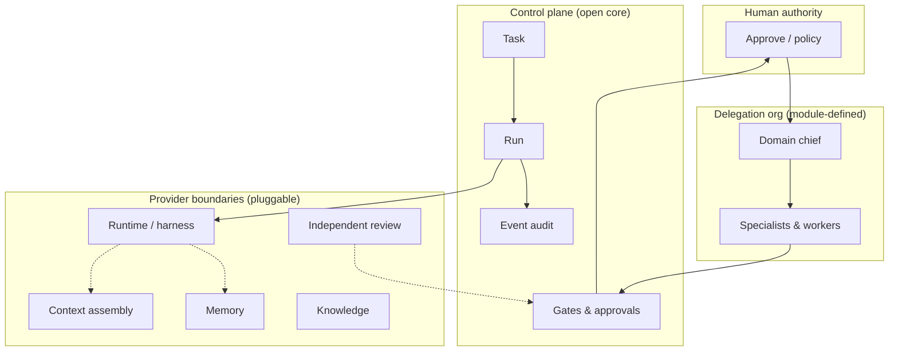

# Khamseen OS

**An open control plane for agentic organizations.**

Khamseen OS is a modular system for composing agent organizations: chiefs, workers, roles, capabilities, skills, tools, data scopes, workflows, correction loops, and human gates. The same lifecycle and gates apply across domains; what changes are skills, data scopes, and domain chiefs.

> **Experimental alpha — incomplete features, APIs subject to change.**

This repository currently publishes **architecture, contracts, and contribution guidance** for the open core. It does **not** yet ship an installable runtime or a one-command quickstart. Executable code lives in a separate private prototype while the generic core is extracted here.

## Value proposition

- **Organize, don't babysit**: specify outcomes; delegate through an explicit org chart and execution graph.
- **Bounded autonomy**: agents run in scoped contexts with tools, budgets, and policies — not unconstrained prompts.
- **Independent review**: reviewers are separate from implementers; findings are not the same as gate decisions or human approval.
- **Human authority**: sensitive outcomes require explicit human approval according to workflow policy.
- **Replaceable providers**: harness/runtimes, context, memory, knowledge, and review backends plug in behind contracts.

**Same lifecycle and gates; different skills, data scopes, and domain chiefs.**

## Target lifecycle

Work moves through a standard pipeline (wording may evolve during extraction):

`REQUEST` → `PLAN` → `DELEGATE` → `IMPLEMENT` → `REVIEW` → `REMEDIATE` → `QA` → `HUMAN_APPROVAL` → `DONE`

- **REMEDIATE** applies after a failed check — bounded correction loops before re-review.
- **HUMAN_APPROVAL** depends on workflow policy (not every task requires it).

## Org chart vs execution graph

| View | What it shows |
|------|----------------|
| **Delegation org chart** | Who may delegate to whom (chiefs, managers, specialists). |
| **Execution graph** | Which units run next and what they depend on (dependencies, parallelism, gates). |

A **loop** makes one unit of work correct (`produce → check → correct → repeat`). A **graph** decides which unit runs next.

## Example modules (illustrative vs delivered)

| Module (example) | Role | In this repo | In private prototype | Notes |
|--------------------|------|--------------|----------------------|-------|
| Engineering | Ship code with review loops | Documented | Partial orchestration | Not a public package yet |
| Research | Literature / analysis workflows | Documented | Planned | Contract-first |
| Operations | Runbooks, incidents | Documented | Planned | — |
| Commerce | Catalog / orders (generic) | Documented | Domain-specific BU | No commerce engine in open repo |
| Career / SaaS / R&D | Extension slots | Documented | Planned | Same lifecycle, different chiefs |

**Delivered today in this public repository:** documentation and issue tracker only.  
**Prototype (private):** experimental Django control plane — useful reference, not mirrored here.

## Architecture principles

1. **Agent ≠ Model** — agents are organizational identities; models are runtime dependencies.
2. **Task ≠ Run** — a task is requested work; each attempt is a run.
3. **Capability ≠ Skill ≠ Tool** — routing, packaged behavior, and executable actions are separate.
4. **Graph ≠ Loop** — coordination between units vs convergence inside one unit.
5. **Context ≠ Memory ≠ Knowledge ≠ Policy** — assembly, retention, facts, and rules differ.
6. **Review finding ≠ gate decision ≠ human approval** — evidence, automated/policy gates, and human authority are distinct.
7. **Business truth outside the LLM** — measured outcomes come from deterministic systems, not invented tokens.
8. **Auditable events** — meaningful actions are durable records, not ephemeral logs.

Details: [ARCHITECTURE.md](ARCHITECTURE.md), [docs/concepts.md](docs/concepts.md).

## Project status

| Area | This repository (`khamseen-os`) | Private prototype | Comment |
|------|--------------------------------|-------------------|---------|
| README & docs | ✅ Published | Internal copies | Public source of truth for open core |
| Executable control plane | ❌ Not yet | ✅ Experimental | Extraction in progress ([issues](https://github.com/Fizioh/khamseen-os/issues)) |
| Module implementations | ❌ Contracts only | Mixed (incl. domain-specific) | Proprietary modules stay private |
| Provider integrations | 📄 Evaluated in docs | Hermes adapter experimental | Not install dependencies here |
| CI / releases | ❌ No runtime release | Private CI | No version tags implying shipped software |

## Documentation

| Document | Purpose |
|----------|---------|
| [ARCHITECTURE.md](ARCHITECTURE.md) | System shape, boundaries, providers |
| [ROADMAP.md](ROADMAP.md) | Open-core milestones |
| [CONTRIBUTING.md](CONTRIBUTING.md) | How to contribute |
| [SECURITY.md](SECURITY.md) | Reporting vulnerabilities |
| [docs/getting-started.md](docs/getting-started.md) | What you can do today |
| [docs/concepts.md](docs/concepts.md) | Vocabulary and invariants |
| [docs/module-contract.md](docs/module-contract.md) | Domain module boundary |
| [docs/decisions/ADR-001-public-core-private-modules.md](docs/decisions/ADR-001-public-core-private-modules.md) | Public / private split |

## Contributing

We welcome documentation fixes, contract reviews, and — once code lands — tests and core extraction PRs. See [CONTRIBUTING.md](CONTRIBUTING.md) and [open issues](https://github.com/Fizioh/khamseen-os/issues).

## License

Apache License 2.0 — see [LICENSE](LICENSE).
