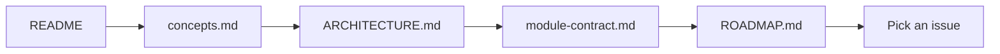

# Getting started

**Experimental alpha.** This repository is primarily **documentation and contracts** today. There is no installable package, Docker quickstart, or guaranteed CLI in this repo yet.

## What you can do today

1. **Read the model** — [README](../README.md) → [concepts.md](concepts.md) → [ARCHITECTURE.md](../ARCHITECTURE.md).
2. **Review contracts** — [module-contract.md](module-contract.md) and [ADR-001](decisions/ADR-001-public-core-private-modules.md).
3. **Pick work** — [GitHub Issues](https://github.com/Fizioh/khamseen-os/issues) (extraction, docs, provider contracts).
4. **Contribute docs** — see [CONTRIBUTING.md](../CONTRIBUTING.md).

## What you cannot do yet (in this repo)

- `pip install khamseen-os` or equivalent — **not published**
- Single-command docker compose up for a full control plane — **not in this repository**
- Run an official end-to-end demo against production agents — **not shipped here**

A private prototype explores implementation; it is **not** mirrored into this repository. Public docs describe the **target open core**, not every line of private code.

## Suggested reading order

## For implementers (upcoming)

When Phase 1 lands, getting started will include:

- Clone + install dev dependencies
- Run core test suite
- Execute a **synthetic** Task → Run → Event trace (no external APIs required)

Track progress via issues labeled `phase-1-extraction`.

## Questions

Open a [Discussion](https://github.com/Fizioh/khamseen-os/discussions) (if enabled) or a well-scoped [issue](https://github.com/Fizioh/khamseen-os/issues) with the `question` label.
