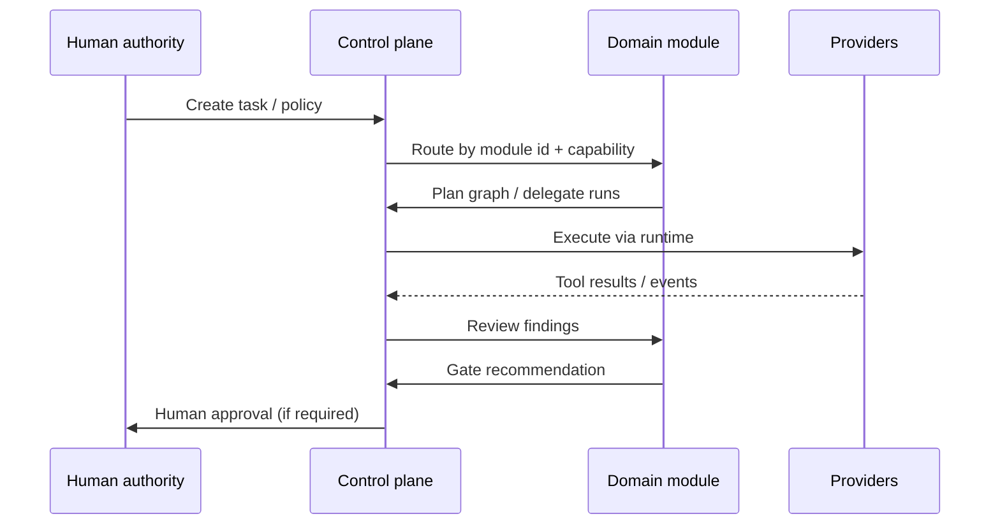

# Module contract

A **module** is a domain package that plugs into the Khamseen OS control plane without forking core primitives.

Examples: engineering, research, operations, commerce, career, SaaS, R&D — same lifecycle, different chiefs and scopes.

## Module delivers

| Artifact | Description |
|----------|-------------|
| **Domain chief** | Top delegate for the module (`agent_type`, escalation to human authority). |
| **Role catalog** | Managers, specialists, workers (organizational, not necessarily 1:1 with graph nodes). |
| **Capability map** | Which capabilities each role may accept. |
| **Skill set** | Versioned skills (tool allowlists, procedures, constraints). |
| **Tool catalog** | Registered tools with schemas and permission scopes. |
| **Data scopes** | What data classes the module may read/write (repo, tickets, catalog, etc.). |
| **Workflow templates** | Default graphs/loops for common outcomes (not mandatory for all tasks). |
| **Policy hooks** | When human approval is required for this domain. |

## Module must not

- Store secrets in the open core repository
- Embed client-specific production configuration
- Replace control-plane primitives (Task, Run, Event, Approval)
- Bypass independent review for implementer-owned work
- Invent business measurements inside LLM outputs

## Control plane ↔ module boundary



## Module manifest (target)

Future modules will declare a manifest (format TBD during extraction), minimally:

```yaml
id: engineering
version: 0.1.0
chief_role: engineering_chief
capabilities:
  - code.write
  - github.pr
data_scopes:
  - repository:scoped
tools:
  - git.commit
  - tests.execute
approval_policy: workflows/engineering.yaml
```

This YAML is **illustrative** — not validated by tooling in this repository yet.

## Validation (planned)

- Schema validation for manifest
- Tool references must exist in registry
- Capabilities must map to known routing table
- No overlapping chief for same module id

Track: GitHub issues labeled `module-contract`.

## Private modules

Proprietary or client-specific modules may remain in private repositories while implementing this contract. The open core publishes **interfaces and reference examples only**.

See [ADR-001](decisions/ADR-001-public-core-private-modules.md).
